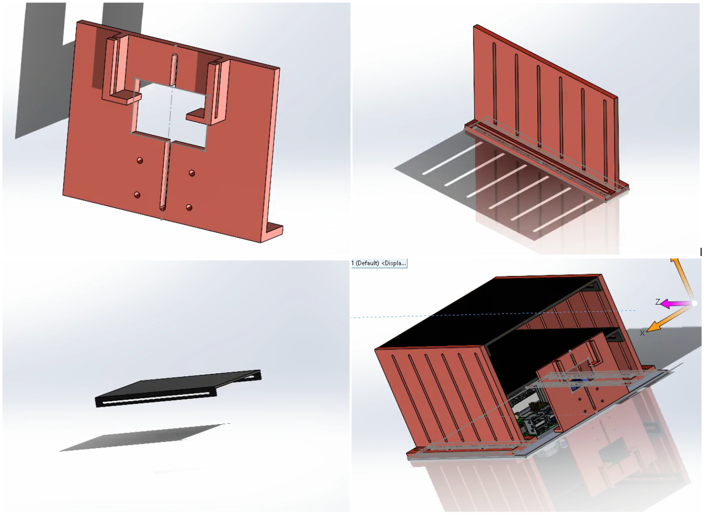

# Raspberry Pi Pick-and-Place Autonomous Robot Build

## The Objective 

My aim is to design and build, from component parts and software modules, a robot capable of autonomous transport--over the unfinished concrete planer inclined surface of a residential swimming pool--of 3D-printed blocks from scattered locations to a designated 2 ft. by 2 ft. drop-off zone, all without colliding with the walls of the swimming pool or undelivered blocks. My motivation for this project is (i) in familiarizing myself with the process of integrating sensors, actuators, and computing boards, (ii) putting into practice some robotics concepts, including navigation, localization, object detection, and drive control, and (iii) establishing a "platform project" that can serve as a physical testing ground as I advance with my University of Maryland (College Park) M.Eng. Robotics Engineering studies, much of which is simulation-based only. 

## The Mechanical Sub-System
The robot's body comprises a commercial-off-the-shelf chassis (DFRobot 4WD Baron Mobile Robot Platform), four commercial-off-the-shelf silicone tread orange and clear motor wheels (Adafruit), a commercial-off-the-shelf servo-gripper assembly (ServoCity Servo-Driven Parallel Gripper Kit), a shelf-based mounting assembly I designed and manufactured, and a perception mounting part I designed and manufactured--these latter two I designed in Dassault Systèmes computer aided design (CAD) program 2024 Solidworks, I prepared for 3-D printing in computer aided manufacturing (CAM) program Prusa Slicer, and I manufactured on Prusa MK3 and Prusa MK4 fusion deposition modeling (FDM) 3-D printers at University of Maryland's Rapid Prototyping Center. I fastened all of the mechanical components with 2 mm and 3 mm machine screws and associated nut, washer, and standoff fastener hardware. The primary challenge with implementing a mechanical subsystem for this robot was in striking a balance between leveraging commercial-off-the-shelf components, which are accessible but come only in a single form, and between leveraging custom-made components, which can be highly tailored to the application at the expense of requiring development time to produce.

The following image collages show the results and the process of my mechanical design and integration efforts to date. 

1. 
2. 
3. 
4. 

The mechanical subsystem, the body of the robot, provides a physical structure, provides holding places for each of the robot's sensors, actuators, integrated circuits, and computing boards, and contributes, to the build, through an adjustable shelving system and a front-facing sensor mount that I designed and manufactured progress towards durability, progress towards modularity, and progress towards adaptability. I developed the shelving system so each shelf can be adjusted for height and fastened securely to shelving side panels with M3 machine screws, nuts, and washers. Robot sensors, actuators, and boards are mounted to each shelf with M2 and M3 fastener hardware. Because I 3-D printed each shelf with an infill density of 50%, additional through holes can be drilled without sacrificing structural integrity when component placement needs changing. Additionally, the front-facing mount, holding the Raspberry Pi camera module (Raspberry Pi Camera Module 2) and ultrasonic distance sensor (RCWL-1601), features 2 mm mounting holes for standoff mounts to the camera, a rectangular cutout for the camera's flat-flex ribbon cable, and a rectangular slide-in retention slot for the distance sensor. While the vehicle is in operation, or when the vehicle is shaken from side to side, no component moves from its mounted position. Furthermore, the shelving system doubles as a case that shields the internal components from dust and debris and remains intact when the robot falls over on its side. 

## The Vision Subsystem
The vision subsystem determines (i) if a 3D printed block exists in the robot’s field of vision, (ii) the degree of misalignment between the robot and any identified block, and (iii) whether an identified block is “in position” to be gripped by the robot’s gripper. To achieve these, I implemented a Python-based and OpenCV-based vision processing pipeline based around HSV masking, morphology operations (opening and closing), contour detection, and bounding box drawing. The logic of the module considers the pixel offset of any detected block’s bounding box from the center of the image, converting this offset into a pivot angle command via multiplication by a pixel to angle calibration ratio. 

In the following video, I demonstrate the vision subsystem’s ability to detect a 3D printed block, determine the angle of misalignment, and determine whether or not the block is in gripping position.

## The Motor Subsystems

### The Drive Motor Subsystem
The drive motor subsystem assists the robot in achieving any (x, y, psi) pose within its operating environment. I built the drive motor system with four “TT gearbox” DC motors, motor driver (L298N), silicone tread wheels, and emergency shutoff switch. Since the L298N supports two motor channels, and since I wanted to achieve differential drive, I connected the both left-side motors to one, and both right-side motors to the other. Regarding sensors, for odometry, I integrated a pair of optical encoders, each mounted to one motor on a different side of the robot, as well as an IMU (BNO055) to track heading. In a Python-based software module, I integrate the sensors and motors, and implement four motion primitive drive functions–two for straight-line motion (forward and reverse) and two for angular pivoting (left pivot and right pivot). Within all four motion functions, I implement feedback control, specifically proportional control. For the straight-line motion functions, the error function derives from IMU heading offset from heading recorded prior to starting motion–for the pivot functions, IMU heading offset from the target heading. All four run within a speed-limited 1 KHz control loop, with the stop condition, for the straight-line motion functions, derived from whether or not encoder ticks equal the required number and for the pivot functions, whether the target heading is within tolerance of the current measurement. 

With the following demonstration, I show the robot’s capability to drive in a square: 

### The Gripper Motor Subsystem
The gripper motor subsystem enables the robot to pick-and-place 3D printed blocks. After the robot identifies a 3D printed block and maneuvers until the block is in position, the gripper activates, grasping the object. While in transit to the destination block drop-off zone, the gripper keeps a firm hold on the block, keeping the block from dropping. When the robot reaches the drop-off zone, the gripper activates again, dropping the block in place. The subsystem comprises a servo-gripper kit (Proton Servo), which I mounted to the front of the robot chassis. The gripper’s servo motor responds to pulse-width modulation (PWM). I implement a Python-based software module to provide functions for opening and closing the gripper. 

In the following video, I demonstrate the robot gripping a 3D printed block, holding it for 5 seconds, then dropping the 3D printed block. 

## The Visual-Motor Integration
The vision and motor subsystems work together. The vision subsystem provides the means for determining the relative position of blocks from the camera. The motor subsystem provides the means for approaching the 3D printed block, then grasping the 3D printed block when the conditions for grasping are met. 

In the following demonstration, I show the robot tracking the 3D printed block, grasping it once in position, reversing slightly, then dropping the block. 

## The Navigation Subsystem
The navigation subsystem provides a means for tracking the robot’s pose throughout the mission. I’ve implemented a software module for navigation that incorporates both interoceptive sensor data (encoders and IMU) and exteroceptive sensor data (sonar). The reason I incorporate both sensor types is to address the sensor-drift challenge of estimated pose from interoceptive sensors alone. The robot tracks its pose based on interoceptive sensor measurements after each motion. When the pose estimate falls within a known corner of the map, the drop-off zone, the robot performs a relocalization routine. The robot spins 360 degrees, collecting sonar measurements. Logic I’ve implemented in software processes the sonar trace by identifying relative distance to walls, and thereby inferring (x, y) position within the pre-loaded map. 

The following video is a demonstration of the robot executing the relocalization routine at the drop-off site. 

The following figure illustrates the sonar trace, with walls showing up as plateaus. 

## Note
This project is a work in progress. I’m currently troubleshooting unreliable pivot maneuvers. Wheel slippage improved after switching from plastic to silicone tires, but not completely. A second issue is insufficient motor torque. The added weight from the 3D-printed mounts and casing, combined with powering four motors from a 6 V AA battery pack through a single L298N motor driver (which drops ~ 2 V internally), leaves too little voltage–and therefore current–at the motor terminals. As a result, the robot frequently stalls during pivots, especially on inclines, even at full PWM. 
